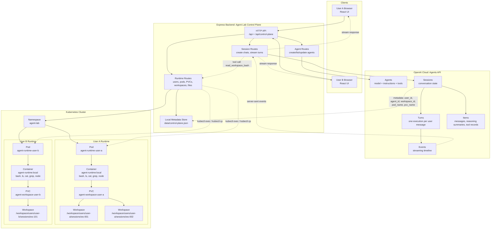
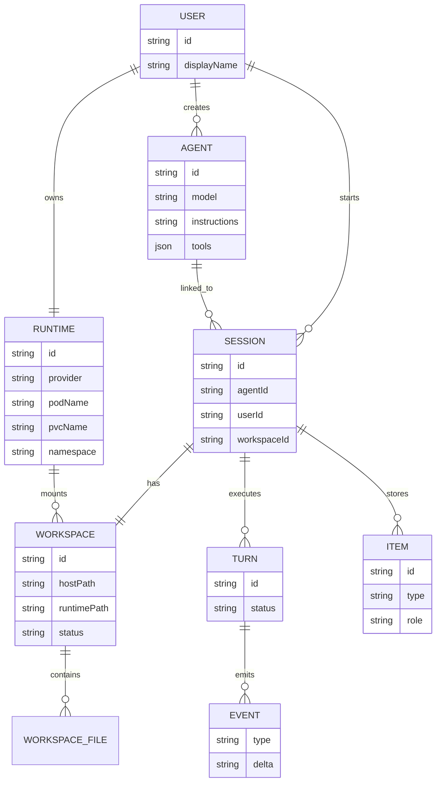
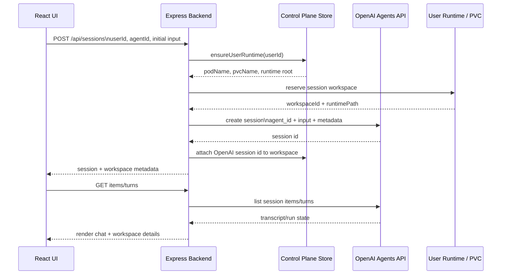
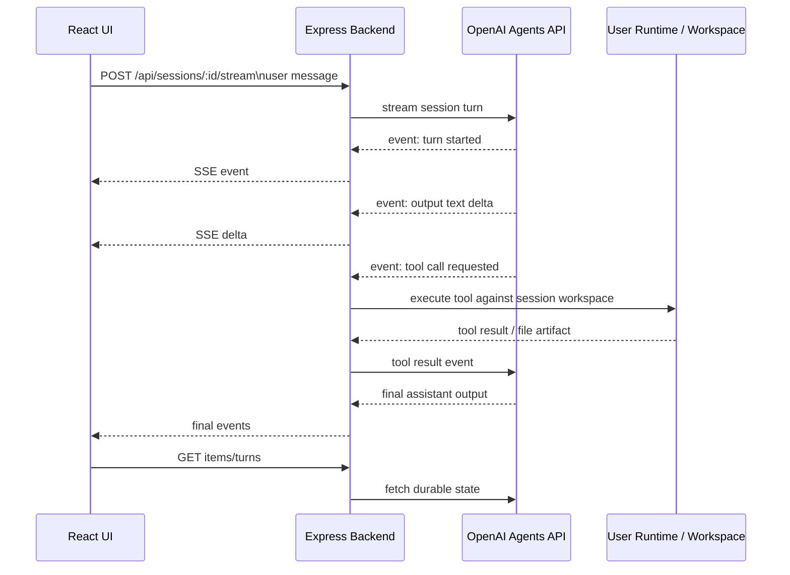

# OpenAI Agents API Backend

This project now includes a separate Express backend and React UI for experimenting with the OpenAI Agents API.

The implementation uses the official OpenAI Node SDK:

```js
client.beta.agents
client.beta.agents.sessions
client.beta.agents.sessions.events
client.beta.agents.sessions.items
client.beta.agents.sessions.turns
```

The SDK sends Agents API requests with the beta header:

```text
OpenAI-Beta: agents=v1
```

## Configure

Create a `.env` file in the project root:

```bash
OPENAI_API_KEY="your_api_key_here"
```

Optional default model override:

```bash
OPENAI_AGENTS_MODEL="gpt-5.6-luna"
```

The root `.env` file is already ignored by Git.

Optional runtime settings:

```bash
RUNTIME_PROVIDER="local" # or "kubernetes"
RUNTIME_IMAGE="agent-runtime:local"
K8S_NAMESPACE="agent-lab"
K8S_STORAGE_SIZE="1Gi"
# K8S_STORAGE_CLASS="standard"
```

## Start The Backend

```bash
npm run start:agents
```

The backend runs on:

```text
http://localhost:3200
```

## Start The UI

```bash
cd client
/Users/shantanujoshi/.nvm/versions/node/v24.18.0/bin/node ./node_modules/vite/bin/vite.js --host 127.0.0.1
```

Open:

```text
http://127.0.0.1:5173/
```

The Vite dev server proxies `/api` to the Agents backend.

## Architecture

The system is split across four responsibilities:

```text
UI:                 agent builder, chat UI, runtime/workspace browser
Backend:            your product control plane
OpenAI Agents API:  agent/session/turn execution loop
Kubernetes runtime: per-user pods, PVC-backed workspaces, skills, artifacts, and tools
```

### Multi-User Architecture



### Storage Map

| Data | Stored Where | Why |
| --- | --- | --- |
| Agent definitions | OpenAI Agents API | OpenAI needs the model, instructions, tools, and reasoning config to run the agent loop. |
| Chat/session history | OpenAI Agents API sessions | OpenAI stores the durable conversation state, turns, items, and streamable events. |
| Runtime metadata | `data/control-plane.json` | The backend needs a local map from users/sessions to pods, PVCs, and workspace paths. |
| Workspace files in local mode | `data/workspaces/<user>/sessions/<workspace-id>/` | Useful for development without Kubernetes. |
| Workspace files in Kubernetes mode | PVC mounted into the pod at `/workspace` | Files survive container restarts and stay isolated per user runtime. |
| Skills | `<workspace>/skills/` | Uploaded or generated capabilities available to that session. |
| Artifacts | `<workspace>/artifacts/` | Files produced by tools or agent work during a session. |

### Per-User Runtime Shape

```text
Kubernetes namespace: agent-lab

User A
  Pod: agent-runtime-user-a
  PVC: agent-workspace-user-a
  Mount path inside container: /workspace
  Session workspaces:
    /workspace/users/user-a/sessions/ws-001/
      files/
      skills/
      artifacts/
    /workspace/users/user-a/sessions/ws-002/
      files/
      skills/
      artifacts/

User B
  Pod: agent-runtime-user-b
  PVC: agent-workspace-user-b
  Mount path inside container: /workspace
  Session workspaces:
    /workspace/users/user-b/sessions/ws-101/
      files/
      skills/
      artifacts/
```

### Entity Relationships



### New Chat Flow



### Message / Run Flow



### Items, Turns, And Events

```text
Items
  Durable session objects: user messages, assistant messages, tool calls,
  tool results, files, and artifacts. Use these to rebuild the chat state.

Turns
  One execution cycle from input to completion. Use these for run history,
  eval records, status, timing, cost, failures, and retries.

Events
  Live timeline emitted while a turn is running. Use these for streaming UI,
  tool progress, approval prompts, and debugging.
```

### Local MVP Versus Kubernetes

The backend supports two runtime providers:

```text
RUNTIME_PROVIDER=local
  stores workspace files on the backend filesystem

RUNTIME_PROVIDER=kubernetes
  creates or reuses a Namespace, PVC, and user runtime Pod with kubectl
  executes workspace reads and bash commands inside that Pod
```

The local provider stores files here:

```text
data/workspaces/<user>/sessions/<workspace-id>/
```

That path represents the PVC-mounted workspace that a real runtime pod would see as:

```text
/workspace/users/<user>/sessions/<workspace-id>/
```

The Kubernetes provider implements the same operations:

```text
ensureUserRuntime(userId)
  kubectl apply Namespace
  kubectl apply PersistentVolumeClaim
  kubectl apply runtime Pod
  kubectl wait for Pod readiness

createSessionWorkspace(userId, sessionId, agentId)
  kubectl exec mkdir -p files/ skills/ artifacts/ inside the PVC
  return runtimePath for session metadata

writeWorkspaceFile(workspaceId, path, content)
  kubectl cp files, skills, configs, and artifacts into the PVC

executeWorkspaceBash(workspaceId, command, cwd)
  kubectl exec a constrained read-only shell command inside the session workspace
```

Build the runtime container:

```bash
npm run build:runtime
```

For Docker Desktop Kubernetes, the `agent-runtime:local` image is usually visible to the cluster after building locally. For Minikube, build inside Minikube's Docker environment or load the image:

```bash
minikube image load agent-runtime:local
```

Then set:

```bash
RUNTIME_PROVIDER="kubernetes"
```

## Routes

```text
GET    /api/status

GET    /api/agents
POST   /api/agents
GET    /api/agents/:id
PATCH  /api/agents/:id
DELETE /api/agents/:id

GET    /api/sessions
POST   /api/sessions
GET    /api/sessions/:id
DELETE /api/sessions/:id

POST   /api/sessions/:id/input
POST   /api/sessions/:id/stream
GET    /api/sessions/:id/events
POST   /api/sessions/:id/events

GET    /api/sessions/:id/items
GET    /api/sessions/:id/turns
GET    /api/sessions/:sessionId/turns/:turnId

GET    /api/control-plane/users
POST   /api/control-plane/users/:userId/runtime
GET    /api/control-plane/users/:userId/runtime
GET    /api/control-plane/users/:userId/workspaces
POST   /api/control-plane/users/:userId/workspaces

GET    /api/control-plane/workspaces/:workspaceId/files
PUT    /api/control-plane/workspaces/:workspaceId/files
GET    /api/control-plane/workspaces/:workspaceId/files/content
POST   /api/control-plane/workspaces/:workspaceId/bash
```

## Control Plane Model

The backend now has a local control-plane layer that mirrors the Kubernetes architecture:

```text
user
  runtime: one pod + one PVC
  workspaces: one session workspace per chat
    files/
    skills/
    artifacts/
```

For local development this is persisted in:

```text
data/control-plane.json
data/workspaces/<user>/sessions/<workspace-id>/
```

In a real cluster, the same records map cleanly to:

```text
podName: agent-runtime-<user>
pvcName: agent-workspace-<user>
runtimePath: /workspace/users/<user>/sessions/<workspace-id>
```

When the UI creates an Agents API session, it sends `userId` and `agentId`. The backend ensures the user's runtime exists, creates a per-session workspace, and stores the workspace/pod/PVC metadata on the OpenAI session.

## Notes

Use `environmentType: "none"` for simple chat/session tests.

Use `environmentType: "openai_hosted"` when you want the managed sandbox behavior described in the Agents API docs.
