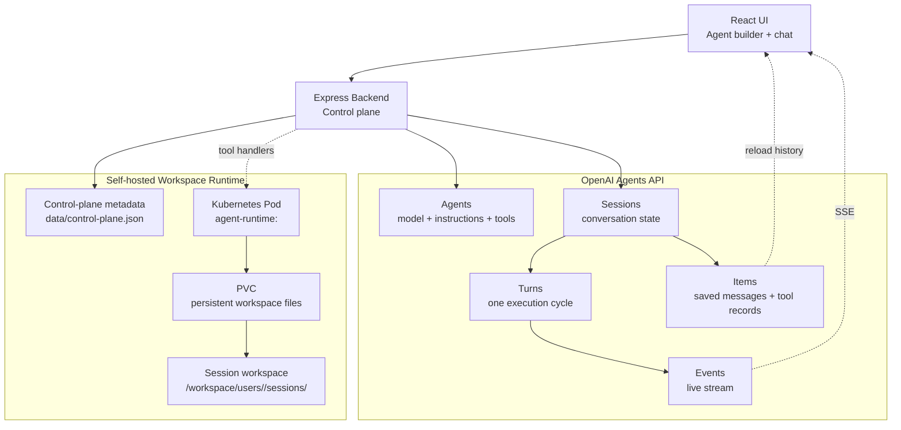

# Agent Runtime Lab

Agent Runtime Lab is a learning project for the OpenAI Agents API. It pairs a React chat UI with an Express control plane and an optional self-hosted workspace runtime backed by Docker, Kubernetes pods, and PVCs.

The goal is to make the agent loop visible:

```text
Agent -> Session -> Turn -> Events -> Items
```

and then connect that hosted loop to a workspace where tools can read files, write files, and run constrained commands.

## Why This Exists

Most agent demos stop at a chat box. This project explores the next layer:

- How OpenAI Agents API sessions preserve state across turns.
- How streamed events drive a real-time UI.
- How session items rebuild durable chat history.
- How tool calls can be routed into a self-hosted workspace.
- How each user can get an isolated runtime and persistent workspace storage.

## Architecture



## OpenAI Agents API Concepts

| Concept | Meaning in this project |
| --- | --- |
| Agent | Saved model configuration: instructions, model, tools, reasoning settings. |
| Session | Long-lived conversation with an agent. |
| Turn | One unit of work triggered by a user message. |
| Events | Live stream of the turn: text deltas, lifecycle changes, tool calls, failures. |
| Items | Durable saved state: messages, reasoning summaries, tool calls, tool results. |
| Tools | Functions the model can request and the backend executes. |

Official docs:

- [Agents API overview](https://developers.openai.com/api/docs/guides/agents-api/overview)
- [Run and continue sessions](https://developers.openai.com/api/docs/guides/agents-api/sessions)
- [Events and items](https://developers.openai.com/api/docs/guides/agents-api/sessions/events)

## Workspace Model

The OpenAI Agents API stores the agent/session/turn state. This app stores runtime metadata and workspace files.

```text
OpenAI cloud
  agents
  sessions
  turns
  items
  events

Agent Runtime Lab
  users
  runtime metadata
  pods/PVCs
  workspace files
```

In Kubernetes mode:

```text
User runtime
  Pod: agent-runtime-<user>
  PVC: agent-workspace-<user>
  Mount path: /workspace

Session workspace
  /workspace/users/<user>/sessions/<workspace-id>/
    files/
    skills/
    artifacts/
```

In local mode:

```text
data/workspaces/<user>/sessions/<workspace-id>/
  files/
  skills/
  artifacts/
```

## Tools

The default workspace agent exposes three tools:

| Tool | Purpose |
| --- | --- |
| `read_workspace_bash` | Read-only inspection: `pwd`, `ls`, `cat`, `find`, `grep`, `sed`, etc. |
| `write_workspace_file` | Create or replace a text file inside the session workspace. |
| `run_workspace_command` | Run allowed executable commands such as `node`, `python3`, or `python`. |

The backend restricts paths and commands:

- no absolute paths
- no `..`
- no shell chaining or pipes
- execution is scoped to the current session workspace

## Project Layout

```text
client/                     React/Vite UI
src/openai-agents/          OpenAI client/config
src/routes/openaiAgents.js  Agents API routes and stream tool handlers
src/routes/controlPlane.js  Runtime/workspace/file routes
src/control-plane/store.js  Local and Kubernetes workspace provider
runtime/Dockerfile          Runtime image used by Kubernetes pods
k8s/                        Kubernetes reference manifest
docs/substack-article.md    Draft article about the project
OPENAI_AGENTS_BACKEND.md    Deeper architecture notes
```

## Setup

Install dependencies:

```bash
npm install
cd client
npm install
cd ..
```

Create `.env`:

```bash
cp .env.example .env
```

Then set:

```bash
OPENAI_API_KEY="your_api_key_here"
OPENAI_AGENTS_MODEL="gpt-5.6-luna"
```

Choose runtime mode:

```bash
# local filesystem workspaces
RUNTIME_PROVIDER="local"

# or real Kubernetes pod/PVC workspaces
RUNTIME_PROVIDER="kubernetes"
RUNTIME_IMAGE="agent-runtime:local"
K8S_NAMESPACE="agent-lab"
K8S_STORAGE_SIZE="1Gi"
```

## Run Locally

Backend:

```bash
npm start
```

Frontend:

```bash
npm run dev:client
```

Open:

```text
http://127.0.0.1:5173/
```

## Kubernetes Runtime

Build the runtime image:

```bash
npm run build:runtime
```

For Docker Desktop Kubernetes, the local image is usually visible to the cluster. For Minikube, load it manually:

```bash
minikube image load agent-runtime:local
```

Create or ensure a runtime from the UI, or call:

```bash
curl -X POST http://localhost:3200/api/control-plane/users/demo-user/runtime \
  -H "Content-Type: application/json" \
  -d '{"displayName":"demo-user"}'
```

Inspect pods and PVCs:

```bash
kubectl -n agent-lab get pods,pvc
```

Inspect files inside a workspace:

```bash
kubectl -n agent-lab exec agent-runtime-demo-user -- \
  find /workspace/users/demo-user/sessions -maxdepth 3 -print
```

## Useful API Routes

```text
GET    /api/status

GET    /api/agents
POST   /api/agents
GET    /api/agents/:id
PATCH  /api/agents/:id
DELETE /api/agents/:id

GET    /api/sessions
POST   /api/sessions
GET    /api/sessions/:id
DELETE /api/sessions/:id
POST   /api/sessions/:id/stream
GET    /api/sessions/:id/items
GET    /api/sessions/:id/turns

POST   /api/control-plane/users/:userId/runtime
GET    /api/control-plane/users/:userId/runtime
GET    /api/control-plane/workspaces/:workspaceId/files
PUT    /api/control-plane/workspaces/:workspaceId/files
POST   /api/control-plane/workspaces/:workspaceId/bash
```

## Notes

This is a learning project, not a production security boundary. Before using a similar design in production, add authentication, authorization, tenant isolation, audit logging, stronger command sandboxing, resource quotas, and a real database-backed control plane.
