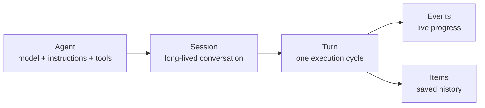
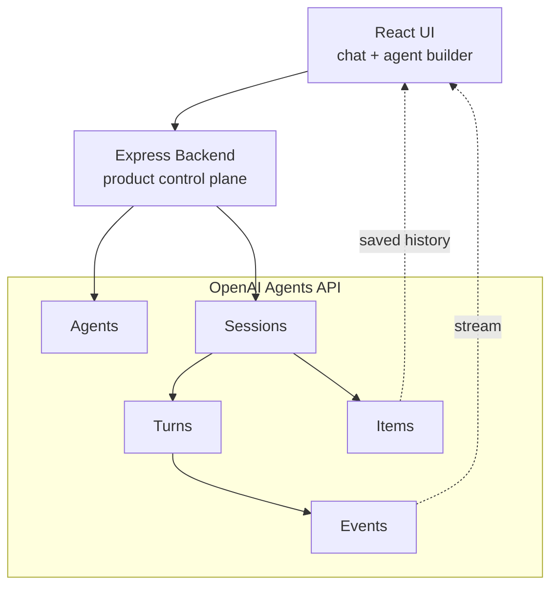
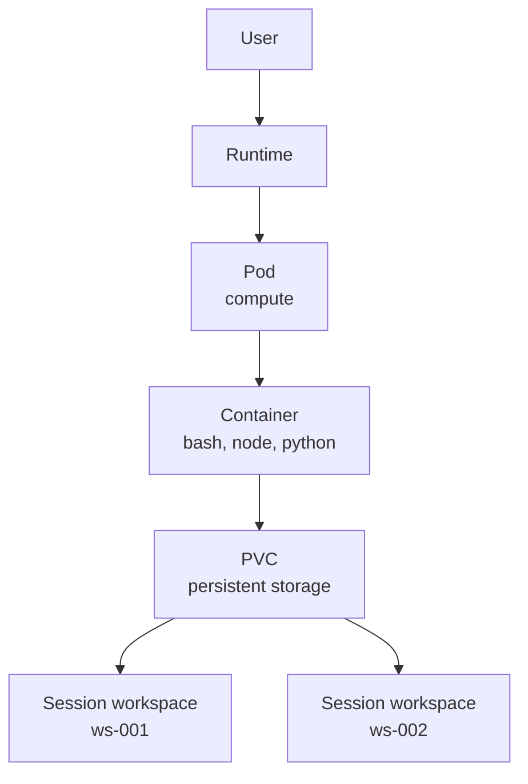
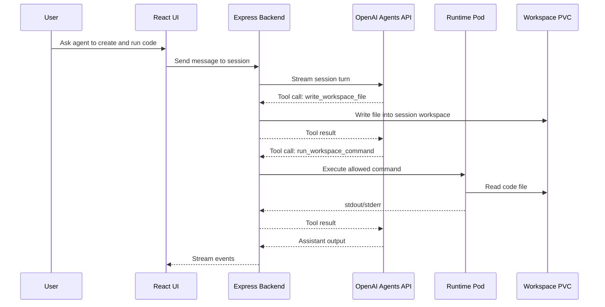
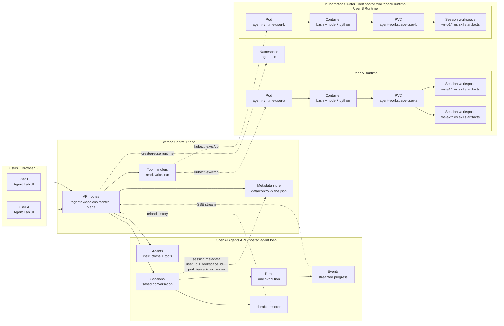

# From Prompt to Pod: What I Learned Building on OpenAI's Agents API

I started this project with a simple goal: understand the OpenAI Agents API by building something small enough to reason about, but real enough to expose the moving parts.

The first version was familiar. A React UI, an Express backend, an agent, a session, and a streamed response. Useful, but still close to a normal chat app.

The interesting part began when I gave the agent a workspace.

Once an agent can inspect files, create a script, run it, and explain the output, the problem changes. Now the session needs durable history. Tool calls need handlers. Files need a persistent home. Code needs a safe place to execute. And if there are multiple users, each user needs an isolated workspace.

That is where this project turned from a chat experiment into a small agent runtime.

This post is a write-up of what I learned while experimenting with the OpenAI Agents API [1] and a self-hosted workspace architecture using Node, React, Docker, Kubernetes, and PVC-backed workspaces.

The short version:

> OpenAI manages the agent loop. My app manages the workspace where the agent does work.

---

## The Part That Changed My Mental Model

The most useful thing about the Agents API is that it gives names to concepts I would otherwise have had to invent myself [1].

Instead of thinking only in "messages", the API nudges you to think in:

```text
Agent
Session
Turn
Event
Item
Tool
Environment
```

That sounds like API vocabulary, but it maps nicely to how agent apps actually behave.

An **Agent** is the reusable definition: model, instructions, tools, and reasoning settings.

A **Session** is a durable conversation with that agent [2].

A **Turn** is one execution cycle, usually started by a user message.

**Events** are the live stream while the agent is working [3].

**Items** are the saved record of what happened: messages, tool calls, tool outputs, reasoning summaries, and artifacts [3].

This matters because an agent is not just generating a response. It may inspect a workspace, call tools, ask for approval, write files, run code, and continue across multiple turns.



The UI can stream events while the turn is running, then reload items to show durable history after the turn completes [3].

That distinction helped me avoid a bug where I accidentally rendered the assistant response twice: once from the live stream and once from saved items.

---

## What OpenAI Manages

In my project, the OpenAI Agents API owns the agent/session layer.

```text
OpenAI Agents API
  agents
  sessions
  turns
  events
  items
  tool call lifecycle
```

My backend creates agents, creates sessions, streams events, lists session items, and handles tool calls.

The official docs describe the Agents API as a hosted Codex harness with managed orchestration, durable session state, context compaction, and recovery [1]. Your app still provides the surrounding product logic, tool integrations, and execution environment.

That boundary is the interesting part.



The API gives me a durable agent loop [1]. But it does not remove the need to decide where my tools run or where my user's files live.

---

## The Missing Piece: A Workspace

Once I added tool calls, I ran into the next design question:

> If the agent wants to inspect files, create code, or run a script, where should that happen?

For local development, I started with a folder on disk:

```text
data/workspaces/<user>/sessions/<workspace-id>/
```

That works, but it is not a great mental model for a real multi-user product.

So I moved toward a self-hosted runtime model:

```text
Runtime = Kubernetes Pod + mounted PVC
```

The pod gives the agent a place to run tools.  
The PVC gives the agent persistent files.

Each user gets a runtime. Each chat session gets a workspace folder inside that user's PVC.



The workspace layout looks like this:

```text
/workspace
  users
    user-a
      sessions
        ws-001
          files/
          skills/
          artifacts/
        ws-002
          files/
          skills/
          artifacts/
```

The `skills/` folder is where this architecture can become more powerful over time. A skill can be a Markdown file, prompt fragment, checklist, rubric, or small capability package that lives with the session. The agent can discover available skills by listing the workspace, read the relevant skill with `read_workspace_bash`, and then apply it while writing files or running commands. For example, a session could include `skills/research.md`, `skills/code-review.md`, or `skills/blog-editor.md`, and the agent could decide which one to use based on the user's request.

The OpenAI session stores the conversation. The workspace stores the files. Metadata links them together:

```json
{
  "user_id": "user-a",
  "workspace_id": "ws-001",
  "pod_name": "agent-runtime-user-a",
  "pvc_name": "agent-workspace-user-a"
}
```

---

## How Tool Calls Fit In

Tool calls are where the architecture becomes concrete.

When the user says:

```text
Create a Python file and run it.
```

the model should not directly get shell access to my backend machine. Instead, it requests a tool call, and my backend decides how to execute it.

I ended up with three workspace tools:

```text
read_workspace_bash
  read-only inspection: ls, cat, find, grep

write_workspace_file
  create or replace a text file in the session workspace

run_workspace_command
  run allowed commands like node or python3
```

The flow looks like this:



The key design principle:

> The model can request work. The backend decides whether and where that work runs.

That gives me a place to enforce constraints: no absolute paths, no `..`, no arbitrary shell chaining, and execution scoped to the current workspace.

---

## Multi-User Shape

For multiple users, the architecture becomes:



The design choice is:

```text
one runtime per user
one PVC per user
many workspaces per user
one workspace per chat/session
```

This keeps users isolated while allowing each user to have multiple long-lived agent sessions.

---

## What I Would Show In A Demo Video

The best demo for this project is not "ask a question and get an answer." The interesting part is watching the agent cross the boundary from hosted reasoning into a self-hosted workspace.

I would record a two-minute demo like this:

1. Create an agent with the three workspace tools enabled: `read_workspace_bash`, `write_workspace_file`, and `run_workspace_command`.
2. Create a new chat, which creates a session and attaches a workspace.
3. Ask: "Create a Python script that prints a tree of the current workspace, run it, and explain the output."
4. Show the activity panel as the agent calls `write_workspace_file`.
5. Show the next tool call where it runs `python3 files/tree.py`.
6. Show the final answer with stdout from the script.
7. Open the workspace file list and show that `tree.py` now exists in the session workspace.
8. If running Kubernetes mode, briefly show `kubectl -n agent-lab get pods,pvc` and `kubectl exec ... find /workspace/...`.

That demo tells the whole story:

```text
OpenAI session state
  -> tool call
  -> Express handler
  -> pod execution
  -> PVC workspace
  -> tool result
  -> final assistant response
```

Two other good demo prompts:

```text
Create a README summary of the files in this workspace and save it to artifacts/workspace-summary.md.
```

```text
Create a small Node.js script that counts files by extension in the workspace, run it, and save the output.
```

Both are visual, easy to understand, and clearly show the difference between a chat-only agent and an agent with a real workspace.

---

## What I Learned

My main learning was that the Agents API gives you a real vocabulary for building agent applications [1].

```text
Agents define behavior.
Sessions preserve state.
Turns represent execution.
Events show live progress.
Items preserve saved history.
Tools connect the model to the outside world.
```

But the other half of the system is still yours.

You need to decide:

```text
Where do tools run?
Where do files live?
How are users isolated?
How does a session find its workspace?
What happens if compute restarts?
How do you observe failures?
```

For this project, my answer was:

```text
OpenAI Agents API for the agent loop.
Express for the control plane.
Docker for the runtime image.
Kubernetes pods for execution.
PVCs for persistent workspaces.
```

The final mental model is simple:

> An agent is not just a prompt. It is a worker with a session, tools, and a place to work.

That place to work is the runtime.

And once you see that, agent apps start to look less like chatbots and more like small cloud IDEs.

---

## References

[1] [OpenAI Agents API overview](https://developers.openai.com/api/docs/guides/agents-api/overview)

[2] [Run and continue sessions](https://developers.openai.com/api/docs/guides/agents-api/sessions)

[3] [Events and items](https://developers.openai.com/api/docs/guides/agents-api/sessions/events)
